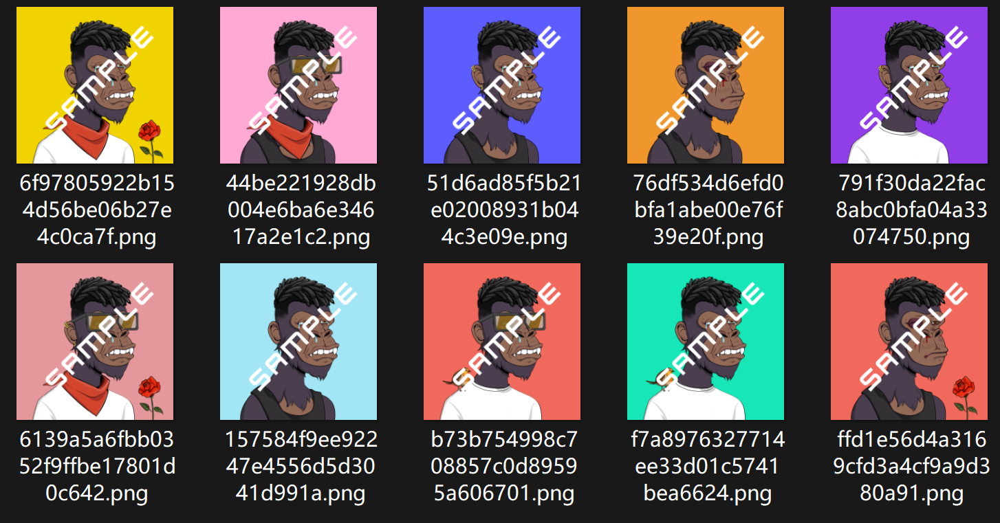
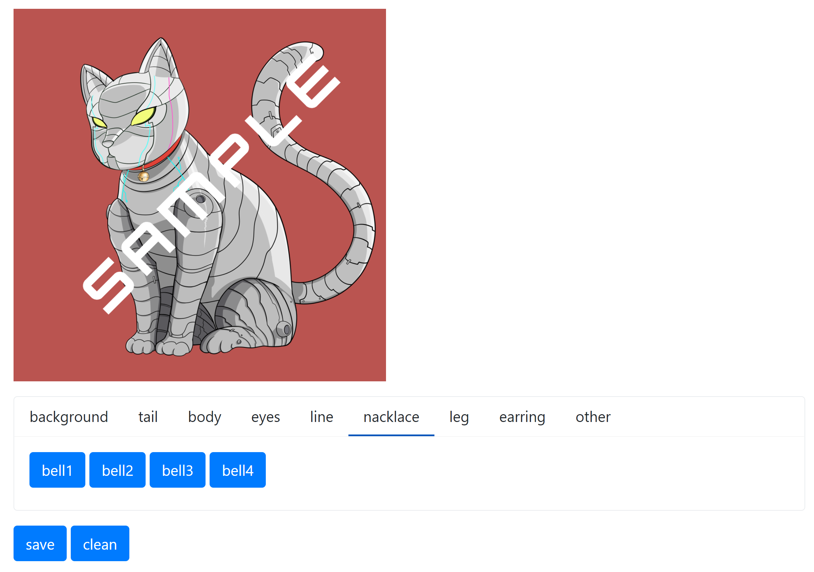

  <h1>GenerativeART4NFT</h1>
  
各パーツの画像を組み合わせことで、NFT用のジェネレーティブアートを生成します。

  

  
  
  
  

  

  <a href="README.md">ENGLISH</a> | 
  <a href="README.md">中文</a> | 
  <a href="README.md">日本語</a>

## プログラム
* 非重複画像の大量生成

* 各パーツの画像を選んで一枚の生成（webアプリ）

  
* processingを用いて、ダウンロードですぐ使えるツールの開発を検討中
